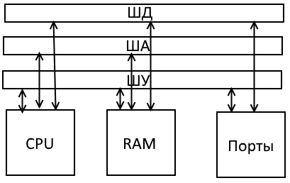

<!--
pandoc --from=markdown+tex_math_dollars+yaml_metadata_block "оп и сп.md" --to=pdf --pdf-engine=xelatex --output="оп и сп.pdf" --fail-if-warnings --standalone --highlight-style=haddock
-->

# О конспекте

Используемый язык — `C/C++`.

Читали лекции: Соколова Татьяна Викторовна (ОП), Клименко Дмитрий Никитич (СП).

## Полезные макросы

```cpp
// случайное число \in [a;b)
#define random(a,b) (rand() % ((b) - (a)) + (a))
// цикл
#define For(a,b) for(int a = 0;a < (b);a++)
```

# Введение

| Сравнение | Компилятор | Интерпретатор |
|-----------|------------|---------------|
| Процесс | _Компиляция_ — программный код целиком переводится в некоторую промежуточную форму — _объектный файл_. _Компановка_ — превращение объектного файла в исполняемый файл программы. | _Интерпретация_ — программный код построчно переводится в команды машинного языка и исполняется. |
| Кодирование | Дополнительные этапы компиляции и компановки программы, в результате чего получается исполняемый файл, недоступный для непосредственного анализа и редактирования. | работать проще, так как команды выполняются в той последовательности, в которой они записаны, что облегчает контроль за выполнением программы |
| Выполнение | Компилятор не требуется | Требуется соответствующий интерпретатор |
| Скорость | Быстрее, так как перевод команд на машинный язык уже произведен на этапе компиляции. | Медленнее, так как перевод команд на машинный язык производится во время выполнения.  |

Программа — отдельные блоки команд (исходного кода), написанных программистом.

Программа — исполняемый программный продукт как единое целое.

## Этапы подготовки и решения задач на ЭВМ

1. Постановка задачи
2. Математическое описание задачи (математическая модель)
3. Выбор и обоснование метода решения
4. Алгоритмизация вычислительного процесса
5. Составление программы
6. Отладка программы и тестирование
7. Решение задачи и анализ результатов

Пример:

Дано: $S$, $a$.

Найти: $P$, $\alpha$, $\beta$, $\gamma$

Решение:

$$
b = \frac {2S} a
$$

$$
c = \sqrt{a^2 + b^2}
$$

$$
\alpha = \arctan \frac a b
$$

$$
\beta = \arctan \frac b a
$$

$$
P = a + b + c
$$

Алгоритм
```
(Начало)
    /Ввод S, a/
    [b = 2S / a]
    [c = sqrt(a^2 + b^2)]
    /Вывод a + b + c/
    /Вывод arctan(b/a)/
    /Вывод arctan(a/b)/
    /Вывод pi/2/
(Конец)
```

# Основы языка

## Первая программа

```cpp
/* Первая программа */
#include <stdio.h>
int main() {
    printf("Hello world\n"); // > Hello world
}
```

Строка `int main()` должна присутствовать в каждой программе. `()` обозначают, что это — функция. Программа на C может содержать одну или несколько функций. Фигурные скобки `{}` означают начало и конец каждого блока (например, функции). Часть программы между ними называется _блоком_. Команда `printf` отвечает за вывод символов, находящихся в кавычках `""`. _Оператором_ называется строка с командой и `;`. Результат работы оператора — вывод сообщения в кавычках.

Cимвол `\` в строке говорит, что за ним следует [escape-последовательность](https://en.wikipedia.org/wiki/Escape_sequences_in_C#Table_of_escape_sequences):

| Символ | Значение |
|--------|----------|
| `\n` | _n_овая строка |
| `\t` | _t_абуляция |
| `\r` | Возв_r_ат каретки |
| `\b` | _b_ackspace |
| `\a` | звуковой сигн_a_л |
| `\"` | собственно `"` |
| `\\` | собственно `\` |

## Типы данных в C

Данные, обрабатываемые компьютером, это константы и переменные.
Все переменные в C должны быть описаны явно.

Описание переменных включает

* спецификацию типа,
* имя переменной,
* а также ряд спецификаторов, задающие особенности переменной (класс хранения)

Для каждой системы размер переменной типа задаётся отдельно.

### Классификация

* скалярный
    + арифметические
    + перечисления `enum`
    + указатели `<type>*`
    + ссылочный тип (reference)
* агрегированный
    + массив `<type>[]`
    + структура `struct`
    + объединение `union`
* неопределенный `void`
* тип-функция

* [основные](http://dfe.petrsu.ru/koi/posob/c/c.htm#g1.2)
    + `char` (символ)
    + `int` (число)
    + `float` (вещественное)
    + `double` (вещественную двойной точности)
    + `void` (не имеющий значения) используется для нейтрализации значения объекта, например, для объявления функции, не возвращающей никаких значений.
* производные
    + все остальные

### Целые

Размер переменной типа в стандарте языка Си не определен.

В большинстве систем программирования размер переменной типа `int` соответствует размеру целого машинного слова. Например, в компиляторах для 16-разрядных процессоров переменная типа `int` имеет размер 2 байта. В этом случае знаковые значения этой переменной могут лежать в диапазоне от `-32768` до `32767`.

Однако задано правило `sizeof(short) <= sizeof(int) <= sizeof(long)`

В «Borland» `short` = 16 разрядов, `int` = 16 разрядов, `long` = 32 разряда.

В «Windows» `short` = 16 разрядов, `int` = 16 разрядов, `long` = 32 разряда.

Разряд подразумевает размещение как положительной, так и отрицательной части числа. Например, x16p даёт возможность записать $2^{16}$ чисел, т.е. в диапазоне от -32768 до +32767, а если сделать беззнаковую запись, то в него поместится число вплоть до 65536.

`unsigned` – просто положительное число (число до 65536), `signed` – отрицательное число, в котором отрицание отмечено самой первой «единицей» на месте седьмого разряда (это числа от -32768 до +32767).

Варианты кодирования отрицательных чисел:

```
not(0110) = 1001 - обратный код
not(0110) + 1 = 1010 - дополнительный код
1010 + 0110 = 0000
```

#### Константы

* `const int n = 10;`
* `#define N 10`
* `0x1F` — 16-ричное
* `07` — 8-ричное
* `0b1010` — двоичное
* `3L` — `long`
* `45u` — `unsigned` беззнаковый

Число `0xFFFF` – самое большое, которое можно уместить в 2 бита `unsigned`.

### `char`

Размер — 1 байт Целочисленный тип, но он интерпретируется компилятором как символ из кодовой таблицы.

* `unsigned`
* `signed`
* `widechar` – широкий `char`.

Константа типа `char` выглядит так: `'a'`, не путать со строкой `"a"`, которая занимает больше места из-за дополнительного символа конца строки:

```
'a' : [31]
"a" : [31][ 0]
```

### `float`/`double`

Их значения имеют дробную часть, отделяемую точкой, например: `-5.6`, `31.28` и т.п. Вещественные числа могут быть записаны также в форме с плавающей точкой, например: `-1.09e+4`. Число перед символом `е` называется _мантиссой_, а после `e` - порядком. Переменная типа `float` занимает в памяти 32 бита. Она может принимать значения в диапазоне от `3.4е-38` до `3.4e+38`.

`double` занимает в памяти в два раза больше места, чем `float` (т.е. ее размер 64 бита). Переменная типа `double` может принимать значения в диапазоне от `1.7e-308` до `1.7e+308`.

`long double` — 80 разрядов.

$$C = M \times 2^P,$$

где $M$ — мантисса, а $P$ — порядок.

## Форматированный ввод/вывод (`scanf`, `printf`)

[Спецификация]((http://en.cppreference.com/w/c/io/fprintf)

* `%d` — `int`
* `%i` — `int`
* `%f` — `float`
* `%lf` — `double`

$1.23$ -> `%10.3f` -> `_____1.230`.

Форматная строка состоит из обычных многобайтовых символов (кроме `%`), которые копируются без изменений в выходной поток и спецификаций преобразования.

Спецификатор формата имеет вид:

    %[флаги][ширина][.точность][размер]тип

### Флаги (0-много)

* `-` — выводимое значение выравнивается _по левому краю_ в пределах минимальной ширины поля (иначе по правому)
* `+` — всегда указывать _знак_ (плюс или минус) для выводимого десятичного числового значения (иначе только для отрицательных чисел)
* `пробел` — помещать перед результатом пробел, если первый символ значения не знак
* `#` — «альтернативная форма» вывода значения
* `0` — дополнять поле до ширины, указанной в поле `ширина` управляющей последовательности, символом 0 (иначе дополнять пробелами)
    + Для целых игнорируется, если явно указана точность.
    + Для других преобразований использование этого флага приводит к неопределенному поведению
    + Игнорируется, если есть флаг `-`

### Модификатор ширины (0-1)

* `ширина` (число или `*`) указывает _минимальную ширину поля_ (включая знак). Результат дополняется пробелами (по умолчанию), если необходимо, слева, когда используется выравннивание по правому краю, или справа, если по левому.
    + Если используется `*`, то ширина определяется по дополнительному аргументу типа `int`.
    + Отрицательный аргумент приводит к использованию флага `-` и к положительной ширине поля (_Примечание_: это минимальная ширина: значение никогда не обрезается).

### Модификатор точности (0-1)

* указывает на минимальное количество символов, которое должно появиться при обработке типов `d`, `i`, `o`, `u`, `x`, `X`;
* указывает на минимальное количество символов, которое должно появиться после десятичной запятой (точки) при обработке типов `a`, `A`, `e`, `E`, `f`, `F`;
* максимальное количество значащих символов для типов `g` и `G`;
* максимальное число символов, которые будут выведены для типа `s`;

### Модификатор размера (0-1)

Поле размер позволяет указать размер данных, переданных функции. Необходимость в этом поле объясняется особенностями передачи произвольного количества параметров в функцию в языке Си: функция не может «самостоятельно» определить тип и размер переданных данных, так что информация о типе параметров и точном их размере должна передаваться явно.

При передаче в функцию аргументов, которым не соответствуют формальные параметры в прототипе функции (а таковыми являются все аргументы, содержащие выводимые значения), эти аргументы подвергаются _стандартным продвижениям_, а именно:

* `float` -> `double`;
* `unsigned char`, `unsigned short`, `signed char` и `short` приводятся к одному из следующих типов:
    + `int`, если этот тип способен представить все значения исходного типа, или
    + `unsigned` в противном случае;
* `bool` -> `int`.

Набор применяемых спецификаторов размера зависит от спецификатора типа:

| Спецификатор| `%d`, `%i`, `%o`, `%u`, `%x`, `%X`   |
| ------------|---- |
| отсутствует | `int` (`unsigned`) |
| `l`         | `long int` (`unsigned`) |
| `ll`        | `long long int` (`unsigned`) |
| `hh`        | `signed char` (`unsigned`) |
| `h`         | `short` (`unsigned`) |

Cпецификации `h` и `hh` используются для компенсации стандартных продвижений типов в сочетании с переходами от знаковых типов к беззнаковым или наоборот.

| Спецификатор | `%a`, `%A`, `%e`, `%E`, `%f`, `%F`, `%g`, `%G` |
| ------------|---- |
| отсутствует | double |
| `L`         | long double |

### Спецификатор типа

* `c` – символ;
* `d`/`i` – десятичные числа;
* `o` – восьмеричное число;
* `u` – десятичное без знака;
* `x`, `X` – шестнадцатеричное число (разница в регистре);
* `f` – вещественное число вида dddd.ddd;
* `e`, `E` — вещественное число экспоненциальной форме (вида 1.1e+44);
* `g`, `G` – система сама решит в каком виде вывести число (зависит от заданной точности);
* `s` – строка (`scanf` воспринимает все символы без преобразования до того, как будет достигнут конец строки или необходимый заданный формат точки, при выводе осуществляется вывод строки до тех пор, пока не будет достигнут конец строки);

## Пример: Арифметика

```cpp
#include <stdio.h>
int main() {
    int ai, bi;
    float af, bf;
    double ad, bd;
    scanf_s("%d %d", &ai, &bi);
    printf("%d + %d = %d\n", ai, bi, ai + bi);
    scanf_s("%f %f", &af, &bf);
    printf("%.2f + %.2f = %.2f\n", af, bf, af + bf);
    scanf_s("%lf %lf", &ad, &bd);
    printf("%.2lf + %.2lf = %.2lf\n", ad, bd, ad + bd);
    return 0;
}
```

## Операторы ввода-вывода в C++

```cpp
 #include <iostream>
cout << "Enter a number";
cin >> a;
cout << "a = " << a << endl;
```

## Простые и составные операторы

Простой:

```cpp
с = sin(b);
```
Составной: группа простых операторов, заключённая в скобки:

```cpp
{
    с = sin(b);
    printf("%f\n", с);
}
```

## Оператор `switch`

```cpp
#include <stdio.h>
int main() {
    int nd = 0; // день недели
    printf("Введите номер дня недели\n");
    scanf("%d",&nd);
    switch (nd) {
        case 1: printf("Пн\n"); break;
        case 2: printf("Вт\n"); break;
        case 3: printf("Ср\n"); break;
        case 4: printf("Чт\n"); break;
        case 5: printf("Пт\n"); break;
        case 6: printf("Сб\n"); break;
        case 7: printf("Вс\n"); break;
        default: printf("Нет!\n");
    }
    return 0;
}
```

## const и volatile

`const` – позволяет определять константы (компилятор препятствует изменению)

```cpp
const double pi = 3.14;
```

`volatile` (летать) – означает, что переменная может изменяться не только текущей программой, но и другими процессами. Этот модификатор указывает компилятору, что не нужно проводить глубокую оптимизацию кода:

```cpp
int k, i = 3;
// если i изменится другим процессом, оптимизация вредит, а не помогает
k = i + 2; —(оптимизация)-> k = 5;
```

# Тема: Операции и выражения

Выражение – последовательность операндов, операций и символов-разделителей.
Операнда – переменная, константа или другое выражение; то, над чем выполняются действия.
Разделителями являются символы: `{}`, `[]`, `;`, `:`, `*`, `=`, `#`, `()`.

TODO: конспект 7.09 первый час

## Операции

### Сравнения

* `>` — больше
* `<` — меньше
* `>=` — больше или равно
* `<=` — меньше или равно
* `!=` — не равно

### Логические операции и Тернарная условная операция

* `&&` - и;
* `||` - или;
* `!` – отрицание;
* `условие ? то : иначе`. Пример:

```cpp
a == 3? a + 5: a - 4
```

### Арифметика

`++` — операция инкремента

`--` — операция декремента.

Преинкремент и постинкремент:

```cpp
a = 4;
c = (a++) + 3; // 8
c = (++a) + 3; // 7
```

### Поразрядные логические операции

* `&` — поразрядное логическое «И»
* `|` — поразрядное логическое «ИЛИ»
* `^` — поразрядное сложение по модулю 2
* `~` — поразрядное логическое «НЕ»

```cpp
a = 0b001 | 0b110 // 0b111
```

### Операции поразрядного сдвига

* `<<` — сдвиг влево
* `>>` — сдвиг вправо

Операции поразрядного сдвига позволяют наиболее эффективно умножать и делить на 2.

Выдигаемые биты теряются. Вдвигаются нулевые биты.

Быстрое деление и взятие остатка от степени двойки:

```cpp
// a / 2^s
a >> s

// 2^s
1<<s

// a % 2^s
a & (1<<s - 1)
```

## Приведение типов

Неявное преобразование типов:

```cpp
int a;
float b;
b = a; // при присваивании int -> float
b = a / 2.0; // при выполнении выражения int -> double -> float
```

Неявные арифметические преобразования работают в основном, как и ожидается. В
общих чертах, если бинарная операция имеет операнды разных типов, то перед выполнением операции «низший» тип преобразуется к «высшему» и получается результат «высшего» типа.

Более точно, к каждой арифметической операции применяется следующая последовательность правил преобразования:

* Типы `char` и `short` преобразуются в `int`,
* а `float` в `double`.
* Затем, если один из операндов имеет тип `double`,
    + то другой преобразуется в `double`,
    + и результат имеет тип `double`.
* Иначе, если один из операндов имеет тип `long`,
    + то другой преобразуется в `long`,
    + и результат имеет тип `long`.
* Иначе, если один из операндов имеет тип `unsigned`,
    + то другой преобразуется в `unsigned`
    + и результат имеет тип `unsigned`.
* Иначе
    + операнды должны быть типа `int`,
    + и результат имеет тип `int`.

Все переменные типа `float` в выражениях преобразуются в `double`; в C вся плавающая арифметика выполняется с двойной точностью.

## Старшинство и порядок вычисления

| операция | ассоциативность |
| :--- | :---: |
| `()` `[]` `->` `.` (вызов функции, взятие элемента массива, выделение поля структурной переменной по её адресу) | l-r |
| `!` `~` `++` `--` `+` `-` `(cast)` `*` `&` `sizeof` | __r-l__ |
| `*` `/` `%` | l-r |
| `+` `-` | l-r |
| `<<` `>>` | l-r |
| `<` `<=` `>` `>=` | l-r |
| `==` `!=` | l-r |
| `&` | l-r |
| `^` | l-r |
| <code>&#124;</code> | l-r |
| `&&` | l-r |
| <code>&#124;&#124;</code> | l-r |
| `?` `:` | __r-l__ |
| `=` `+=` `-=` `etc.` | __r-l__ |
| `,` | l-r |

# Массивы

_Массив_ — расположенные в памяти друг за другом элементы одного типа.

_Имя массива_ — указатель-константа на нулевой элемент массива.

Инициализация по умолчанию нулями происходит только для статических и внешних массивов.

| $i$  | 0 |  1 | 2 |  3 | 4 | 5 |  6 | 7 | 8 | 9 |
|--------|---|----|---|----|---|---|----|---|---|---|
|$a[i]$| 3 | -3 | 4 | -5 | 6 | 7 | -7 | 8 | 9 | 0 |

`int foo[10];` — объявление без инициализации.

`int foo[10] = {1}` — оставшиеся ячейки либо заполнятся нулями, либо не будут инициализированы.

`int foo[] = {1,2,3}` — компилятор определит размер массива.

Ввод и вывод массивов производится с помощью циклов.

`mas[i][j]` — обращение к элементу на пересечении i-й строки и j-го столбца.

`int a[2][3] = {{0,0,0},{0,0,0}};` — двумерный массив.
`int mas[2][2] = {0,0,0,0}` — допустимо.

## Пример

Дана матрица, значения заданы с клавиатуры. Отобрать те, что больше 0 и записать в новый (динамический) массив.

```cpp
// 2darray.c
#include <stdio.h>
#include <locale.h>
#include <stdlib.h>

// форматированный вывод массива
// x — количество элементов
// b — массив
// name — его имя
void print_arr(const int x, int b[], char name[]) {
    printf("Массив %s[%d] = {", name, x);
    for (int i = 0; i < x; i++) {
        printf("%d, ", b[i]);
    };
    printf("\b\b}\n");
}
int main() {
    setlocale(LC_CTYPE, "Rus");

    const int n = 3, m = 4;// строки, столбцы
    int *p = new int[n*m]; // задание динамического массива.
    int i, j, k, a[n][m] = {
        {2, 3, -1, 4},
        {3, 7, 8, -5},
        {0, 9, -3, 0}};
    // ввод массива a[n][m]
        printf("Введите элементы массива A[%d][%d] через пробел, разделяя строки '\\n':\n", n, m);
        for (i = 0; i < n; i++) {
            for (j = 0; j < m; j++)
                scanf_s("%d", &a[i][j]);
        }
    // вывод массива a[n][m]
        printf("a = {\n\t");
        for (i = 0; i < n; i++) {
            for (j = 0; j < m; j++)
                printf("%d, ", a[i][j]);
            printf("\b\b\n\t");
        };
        printf("\r}\n");

    k = 0;
    for (i = 0; i < n; i++)
        for (j = 0; j < m; j++)
            if (a[i][j] > 0) {
                p[k] = a[i][j];
                k++;
            }
    for (i = k; i < n*m; i++) {
        p[i] = 0;
    }
    print_arr(n*m,p,"p");
    delete[] p;
    system("pause");
}
```

# Циклы

`while (condition) { … }` — пока `condition` истинно, тело выполняется.

`do { … } while (condition)` — тело выполняется, пока `condition` истинно.

`for (int i = 0; i < n; i++) { … }` — тело выполняется `n` раз.

## Операторы `break` и `continue`

`break` позволяет прервать выполнение цикла или сопоставление в `switch`.

`continue` позволяет прервать выполнение итерации и перейти к следующей, если это возможно.

## Случайные числа

Пример работы со случайными числами

```cpp
// rand1.c
#include <time.h>
#include <stdio.h>
#include <stdlib.h> // srand()
#include <locale.h>
#define random(a,b) rand() % (b - a + 1) + a

int main() {
    setlocale(LC_ALL, "Rus");
    int var,c;
    srand(time(NULL)); // инициализация генератора псевдосл чисел
    do {
        system("cls");
        printf("Выпало: %d\nДля выхода нажмите пробел, а затем Enter", random(1, 6));
    } while (c = getchar() == '\n');
    system("pause");
}
```

# Файлы

Файлы последовательного доступа могут быть открыты в режиме чтения `r`, записи `w` и дозаписи `a`.

```
Если файл открывается:
    на чтение
        Если не существует -> Ошибка!
        иначе              -> будет создан
    на запись
        Если не существует -> будет создан
        иначе              -> новая информация будет записана поверх старой
    на дозапись
        Если не существует -> будет создан
        иначе              -> новая информация будет записана в конец файла
```

# Работа с указателями

`m[i]` $\equiv$ `*(m + i)`

`*(array + n * i + j)` $\equiv$ `array[n * i + j]` $\equiv$ `array[i][j]`

`int *p = new int[n*m];` — задание динамического массива.

```cpp
#include <stdio.h>
#include <conio.h>
#include <stdlib.h>
int main() {
    const int N = 10;
    int i,a[N] = { 3,-3,4,-5,6,7,-7,8,9,0 };
    // int *p; // объявление указателя * - взятие значения по адресу
    // p = a; // a[i] === *(a + i)
    printf("a[i] = a[i] = *(a + i)\n");
    for (i = 0; i < N; i++) {
        printf("a[%d] = %d = %d\n", i, a[i], *(a + i));
    }
    system("pause");
    return 0;
}
```

_Указатель-переменная_ — адрес в памяти.

_Указатель-константа_ — адрес в оперативной памяти.

```cpp
int* pnt1; // определение указателя
int c = *pnt1; // взятие переменной по адресу
pnt1 = &c; // взятие адреса переменной
```

Так как указатель содержит адрес объекта, это даёт возможность «косвенного» доступа к этому объекту через указатель. Предположим, что `x` – переменная, например, типа `int`, а `px` – указатель, созданный неким ещё не указанным способом. Унарная операция `&` выдаёт адрес объекта, так что оператор

```cpp
px = &x;
```

присваивает адрес `x` переменной `px`; говорят, что `px` «указывает» на `x`.

Операция `&` применима только к переменным и элементам массива, не применима к:

* константам `&12`
* выражениям `&(a*2)`
* переменным в регистре (`register int i;` рекомендует компилятору поместить переменную в регистр)

Унарная операция `*` рассматривает свой операнд как адрес конечной цели и обращается по этому адресу, чтобы извлечь содержимое. Следовательно, если y тоже имеет тип `int`, то

```cpp
y = *px;
```

присваивает y содержимое того, на что указывает `px`. Так последовательность

```cpp
px = &x;
y = *px;
```

присваивает `y` то же самое значение, что и оператор

```cpp
y = x;
```

Сам указатель является переменной и от него также можно взять адрес.

```cpp
int** pnt2 = &pnt1; // создан указатель на указатель;
```

```cpp
void *x; // В данном случае говорит об отсутствии данных о типе переменной.
```

Согласно идеологии intel младший байт в памяти находится по младшему адресу.

Так переменная `var`

```cpp
unsigned int var = 0xFFCC;
```

будет храниться в памяти так:

```cpp
// [0][CC]
// [1][FF]
```

```cpp
unsigned long block = 0xFFEEDDCCL;
// [0][CC]
// [1][DD]
// [2][EE]
// [3][FF]
void *ptr = &block; // ptr — адрес block
char ch = * (char*) ptr; // = 0xCC
unsigned aa = * (unsigned*) ptr; // = 0xDDCC
long bb = * (long*) ptr; // = 0xFFEEDDCC
```

## Адресная арифметика

```cpp
char *ptr;
ptr++;
// (ptr + 1) указывает на следующий блок размера char
```

## Указатели символов

_Строковый литерал_ — последовательность любых символов, заключенная в парные двойные кавычки: `"qwerty"` (Б.В. Керниган, Д.М. Ричи. «Язык программирования С» 5.8).

_ASCIIZ-строка_ — массив `char[]`, в конце которого нулевой символ `'\0'`:

| 0 | 1 | 2 | 3 | 4 | 5 | 6 |
|---|---|---|---|---|---|---|
| q | w | e | r | t | y | \0|

Записи типа

```cpp
char s1[] = "word";
char s2[6] = "word";
char s3[6] = {'w','o','r','d'};
```

равнозначны (указатель-константа, не допускает присваивания литералом).

Если литерал является указателем типа `char`, то он указывает на первый символ.

```cpp
char *s = "Слово";
s = "Вот"; // (2)
```

`(2)` — Это не копирование строки; здесь участвуют только указатели. В языке C не предусмотрены какие-либо операции для обработки всей строки символов как целого.

## Массивы указателей; указатели указателей

```cpp
char *lineptr[2] = {"foo", "bar"};
```

сообщает, что `lineptr` является массивом из `2` элементов, каждый из ко-
торых – указатель на переменные типа `char`. Это означает, что `lineptr[i]` – указатель на символы, а `*lineptr[i]` извлекает символ.

## Многомерные массивы

```cpp
int matrix[2][2] = {{1,2},{3,4}};
//
int m[][3] = {{0},{1,2},{3,4,5}}
// [0][N][N]
// [1][2][N]
// [3][4][5]

```

# Работа со строками

В языке Си нет отдельного типа «строка символов», строка — одномерный массив типа `char`, заканчивающийся «нулевым байтом».

```cpp
char ch = 'r'; //1 символ в 1 байт в одинарных кавычках
char HH[2] = "r"; // Двойные кавычки для строк. Почему же [2]?
```

Нулевой байт это байт, каждый бит которого равен 0. Для него определена специальная символьная константа `'\0'`, которая и ставится в конце каждой строки, обозначая её конец.

Если строка должна содержать N символов, то в описании массива следует указать N+1 элемент.

```cpp
char str[50]; // (49 рабочих + 1 символ конца строки)
```

Строковая константа — список символов, заключённых в двойные кавычки. В ее конец не нужно ставить `'\0'`, т.к. это сделает сам компилятор.

## Ввод строки и символа с клавиатуры

```cpp
scanf_s(""); //берёт только 1 слово до 1 пробела
char *gets(char *); //get string - взять строку
int getchar(void); //get char - взять символ
```

## Вывод строк

```cpp
void printf(...);
int puts(const char *);
```

Функция `puts` добавляет в конце выводимой строки символ новой строки

## Функции для работы со строками

(имеется библиотека `<string.h>`):

* `char *strcpy(char *dst, const char *src)` — перезаписывает строку S2 в строку S1, при этом используется память от строки S1, важно, чтоб было место для всей S2
* `char *strcat(char *dest, const char *src);` — присоединяет строку S2 к строке S1, помещает в конец S1, после её содержимого, нулевой байт, которй завершал S1 будет замещён на первый смимвол S2
* `size_t strlen(const char *);` — возвращает длину строки без нулевого байта
* `int strcmp(const char *, const char *)` — сравнивает строки S1 и S2 (возвращает `0`, если строки одинаковые, положительное, если первая строка больше, и отрицательное, если меньше).

Пример программы, работающей со строками:

```cpp
#include <stdio.h>
#include <locale>
#include <conio.h>

int main() {
    setlocale(LC_ALL, "Rus");
    char str[49 + 1];
    //char ch = 'r'; // 1 символ в 1 байт в одинарных кавычках
    printf("Введите строку, ограничение - 49 символов\n");
    gets_s(str);
    puts(str);
    printf("Вы ввели строку: %s\n", str);

    char str10[11];
    int i;
    for (i = 0; i < 10; i++) {
        str10[i] = getchar();
    }
    //scanf_s("%s", str10,strlen(str10));
    printf("str10's len = %d\n", strlen(str10));
    puts(str10);

    system("pause");
    return 0;
}
```

# Файлы произвольного доступа

## Двоичный файл

Отдельные записи в файле с произвольным доступом обычно имеют фиксированную длину, что позволяет получить к ним непосредственный (значит быстрый) доступ без поиска по всем записям. Поэтому файлы с произвольным доступом используются в системах бронирования мест на самолеты, банковских системах, системах складского учета и других системах обработки транзакций, требующих быстрого доступа к данным.

Существуют другие способы обеспечения произвольного доступа к файлам, но мы ограничим наше обсуждение подходом, использующим записи с фиксированной длиной, ввиду его простоты и наглядности.

Так как все записи файла с произвольным доступом имеют равную длину, можно вычислить точное положение записи относительно начала файла как функцию ключа записи. Вскоре мы увидим, каким образом это помогает получить мгновенный доступ к конкретной записи, даже в случае, когда размер файла очень велик.

Функция `fwrite` пересылает в файл заданное число байт начиная с указанного адреса памяти. Данные записываются с того места в файле, которое обозначено указателем позиции файла.

Условие задачи

> Создать программу для работы со счетами клиентов компании, способную хранить до ста записей с фиксированной длиной. Каждая запись должна состоять из номера счета, который будет использоваться как ключ, имени, фамилии и сальдо. В программе должны быть предусмотрены возможности: обновлять счета, вставлять записи с новыми счетами, удалять счет и выводить список всех записей со счетами в отформатированном виде, пригодном для печати, в текстовый файл. Использовать для работы файл с произвольным доступом. (Х. М. Дейтел, П. Дж. Дейтел - Как программировать на С, с. 503)

| № счета | Фамилия | Имя  | Сальдо|
|--------|---------|------|-------|
| 1      | Фамилиев | Имен | 233   |

```cpp
int blank()
{
    int i;
    FILE *cfPtr;
    struct clientData blankClient = { 0,"","",0.0 };

    fopen_s(&cfPtr, "credit.dat", "wb");

    for (i = 0; i < 100; i++)
        fwrite(&blankClient, sizeof(clientData), 1, cfPtr);

    fclose(cfPtr);
    printf("Created credit.dat");
    return 0;
}
```

В нашей программе в результате выполнения оператора `fwrite(sblankClient, sizeof(struct clientData) , 1, cfPtr);` структура `blankClient` размером `sizeof(struct clientData)` будет записана в файл, указанный `cfPtr`. Операция `sizeof` возвращает размер в байтах для объекта, содержащегося в скобках (в данном случае — это `struct clientData`). Операция `sizeof` является исполняемой во время компиляции одноместной операцией, возвращающей целое число без знака.

Операция `sizeof` может использоваться для определения размера в байтах для любого типа данных или выражения. К примеру, `sizeof(int)` используется для того, чтобы определить, хранится целое в двух или в четырех байтах для данного конкретного компьютера.

## Произвольная запись в файл произвольного доступа

Программа записывает данные в файл `credit.dat`. Для хранения данных в специально определенных местах файла используется комбинация `fseek` и `fwrite`. Функция `fseek` устанавливает указатель позиции файла в заданное положение, после чего `fwrite` записывает данные.

```cpp
int enter() {
    FILE *cfPtr;
    struct clientData client;
    fopen_s(&cfPtr, "credit.dat", "r+");
    printf("Enter account number (1 to 100, 0 to end input)\n> ");
    scanf_s("%d", &client.acctNum);
    while ((client.acctNum > 0) & (client.acctNum <= 100)) {
        printf("Enter lastname, firstname, balance\n> ");
        scanf_s("%s%s%f", client.lastName, (rsize_t)sizeof client.lastName, &client.firstName, (rsize_t)sizeof client.firstName, &client.balance);
        fseek(cfPtr, (client.acctNum - 1) * sizeof(clientData), SEEK_SET);
        fwrite(&client, sizeof(struct clientData), 1, cfPtr);
        printf("Enter account number\n> ");
        scanf_s("%d", &client.acctNum);
    }
    fclose(cfPtr);
    return(0);
}
```

Оператор

```cpp
fseek(cfPtr, (accountNum -1) * sizeof(struct clientData), SEEK_SET);
```

устанавливает указатель позиции файла, на который ссылается `cfPtr` на байт, определяемый выражением `(accountNum-l)*sizeof(struct clientData);` значение этого выражения называется смещением. Поскольку номер счета — число от 1 до 100, а байты в файле начинаются с нулевого, то при нахождении положения байта из номера счета вычитается 1. Таким образом, для первой записи указатель позиции файла устанавливается на байт 0 файла. Символическая константа
`SEEK_SET` показывает, что указатель позиции файла устанавливается относительно начала файла на величину смещения. Рассмотрение приведенного выше оператора показывает, что поиск в файле счета с номером 1 устанавливает указатель позиции файла на начало файла, поскольку вычисленное значение равно 0. Указатель позиции файла показывает, что следующий байт, который будет считан или записан, это пятый байт от начала файла.

Согласно стандарту ANSI прототип функции `fseek` определяется как

```cpp
int fseek(FILE *stream, long int offset, int whence);
```

где `offset` — число байт от положения, задаваемого `whence`, в файле, на который указывает `stream`. Аргумент whence может иметь одно из трех значений — `SEEK_SET`, `SEEK_CUR` или `SEEK_END`, — указывающих место в файле, с которого начинается поиск. `SEEK_SET` указывает, что поиск начнется с начала файла; `SEEK_CUR` указывает, что поиск начнется с текущего положения в файле; и наконец, `SEEK_END` указывает, что поиск начнется с конца файла. Эти три символические константы определены в заголовочном файле `stdio.h`.

## Последовательное чтение данных из файла произвольного доступа

Функция `fread` считывает заданное число байт из файла в память. Например, оператор

```cpp
fread(Sclient, sizeof(struct clientData), 1, cfPtr);
```

считывает число байтов, равное `sizeof(struct clientData)`, из файла, на который ссылается `cfPtr`, и сохраняет данные в структуре `client`. Байты считываются из файла начиная с места, определенного указателем позиции файла. Функцию `fread` можно использовать и для чтения нескольких элементов массива с фиксированным размером с помощью указателя на массив, в котором будут храниться элементы, и указанием числа элементов, которые необходимо прочитать. Представленный выше оператор определяет, что должен быть прочитан один элемент. Для того чтобы прочитать более одного элемента, необходимо задать соответствующее значение в третьем аргументе функции `fread`.

Программа считывает последовательно каждую запись из файла
`"credit.dat"`, проверяет все записи на наличие данных и распечатывает содержащие данные записи в форматированном виде. Функция `feof` отслеживает момент, когда достигается конец файла, а функция `fread` передает данные с диска в структуру `client` типа `clientData`.

```cpp
int print() {
    FILE *cfPtr;
    struct clientData client;
    fopen_s(&cfPtr, "credit.dat", "r");
    printf("%-4s | %-15s | %-10s | %10s\n", "Acct", "Last Name", "First Name", "Balance");
    printf("-----|-----------------|------------|-----------\n");
    while (!feof(cfPtr)) {
        fread(&client, sizeof(clientData), 1, cfPtr);
        if ((client.acctNum > 0) & (client.acctNum <= 100))
            printf("%-4d | %-15s | %-10s | %10.2f\n",
                client.acctNum,
                client.lastName,
                client.firstName,
                client.balance);
    }
    printf("-----|-----------------|------------|-----------\n");
    fclose(cfPtr);
    return(0);
}
```

## Пример: программа обработки транзакций

Следующая программа предназначена для работы с банковскими счетами. Программа позволяет обновлять существующие счета, добавлять новые, уничтожать счета и сохранять список всех текущих счетов в файле текстового формата для вывода на печать. Предполагается, что была выполнена программа, создающая файл
`credit.dat`.

# Аргументы функции main

```cpp
#include <stdio.h>
#include <conio.h>
#include "windows.h"
int main(int argc, char const *argv[]) {
// argc = кол-во слов = 1+1 = 2
// argv[0] = "%cd%\argmain.exe"
// argv[1] = "a1.txt"
    //debug
    printf("argc = %d\nargv[0] = %s\nargv[1] = %s\n", argc, argv[0], argv[1]);
    // проверка на ввод аргумента
    if (!(argc - 1)) {
        printf("%s\n", "No arguments found");
        system("pause");
        return -1;
    }
    FILE *f;
    fopen_s(&f, argv[1], "w");
    fprintf_s(f, "sample text");
    fclose(f);
    printf("%s\n", "Done!");
    system("pause");
    return 0;
}
```

## Использование

### В командной строке

    H:\Documents\ОП\semestr2\Debug>semestr2.exe 1.txt
    argc = 2
    argv[0] = semestr2.exe
    argv[1] = 1.txt
    Done!
    Press any key to continue . . .

### В Visual Studio

Для этого в окне `Project -> %Project-Name% - properties`: `Configuration Properties -> Debugging -> Command Arguments` можно задать аргумент.

# Функции

Функция — логически самостоятельная именованая часть программы, которой могут передаваться параметры и которая может возвращать какое-то значение.

    [тип данных] имя_функции(список аргументов | void)

Значением этого указателя является точка входа в функцию. Список параметров в определнии функции является формальным аргументов.

```cpp
//функция_1
void count(int a, int b, int c, int*S_osn, int*V)
{
    *S_osn = a * c;
    *V = a * b * c;
}
```

При каждом вызове в функцию передаётся список параметров, называемый списком фактических аргументов.

```cpp
count(a, b, c, &S_osn, &V);
```

Первое дейтсвие, выполняемое кодом, генерируемым компилятором — запись в стек переменных или констант, перечисленных в списке аргументов, если он не пустой. Далее – вызов функции и возврат из неё.

```cpp
int func(int mas[]) { }
```

## Пример работы с функциями и их аргументами

```cpp
#include <stdio.h>
#include <locale.h>
#include <stdlib.h>
void param(int, int *, int *); // прототип функции
int param_S(int a) { return a * a; }
int param_P(int a) { return 4 * a; }
void printSP(int a, int s, int p) {
    printf("a=%d\ts=%d\tp=%d\n", a, s, p);
}
void main() {
    int a, S, P;
    a = 4;
    // передача парамеров через список (адреса и указатели)
    param(a, &S, &P); // вызов функции
    printSP(a, S, P);
    // передача параметров через return
    S = param_S(a);
    P = param_P(a);
    printSP(a, S, P);
    system("pause");
}
void param(int a, int *s, int *p) {
    *s = a * a;
    *p = 4 * a;
}
```

Задание:

* Функцию для проверки значения для одного типа данных
* сделать функции для всех типов данных (перегрузка функций)

```cpp

// Функция выводит сообщение об ошибке при неверном вводе
// Аргументы: var - переменная, cond - условие, которому должна
// соответствовать var, name - имя переменной, cond_txt - текст условия
// Возвращает 1 если условие ложно
// Использование
// do {printf("s = ");scanf(s);...} while (!verified(s,s>0,"s","> 0"))
bool verified(int var, bool cond, char name[], char cond_txt[]);

int main() {
    return 0;
}

bool verified(bool cond, char name[], char cond_txt[]) {
    if (!cond)
        printf("Bad input. Try again\n%s must be %s!\n", name, cond_txt);
    return cond;
}
```

# Перегрузка функций

_Полиморфическая функция_ — функция, отличающаяся многообразием форм.

Под полиморфизмом функции понимают существование в программе нескольких перегруженных версий функции, имеющих разное назначение.

_Перегрузка функций_ или _полиморфизм_ — механизм, (в языке C++) позволяющий писать несколько функций с одним именем, но с разными сигнатурами.

Перегруженные функции должны отличаться друг от друга списками параметрами: разные типы у одного или нескольких аргументов, разное количество аргументов.

Типы возвращаемых значений перегруженных функций могут быть одинаковыми или разными.

> При создании двух функций с одинаковыми списком параметров, но с различными типами возвращаемых значений, будет сгенерирована ошибка компиляции:

```cpp
int sum(int,int);
float sum(float,float); // (1)
double sum(double,double);
double sum(double);
double sum(float,float); // ошибка! (конфликт с (1) )
```

Никакой путаницы при вызове функций не будет, так как нужная функция определяется по совпадению типов и количества параметров. Благодаря использованию перегруженных функций не нужно беспокоиться об имени вызываемой функции.

Компилятор автоматически определит, какой именно вариант функции следует использовать.

__Задача__

> Написать функции, 3 из которых суммируют числа разных типов и четвертую, возвращающую удвоенное значение (прототипы даны).

```cpp
// решение
int sum(int a,int b) {
    return a+b;
}
float sum(float a,float b) {
    return a+b;
}
double sum(double a,double b) {
    return a+b;
}
double sum(double a) {
    return 2 * a;
}
```

# Рекурсия

_Рекурсия_ — определение, описание, изображение какого-либо объекта или процесса внутри самого этого объекта или процесса.

## Простой пример

```cpp
void R(int n) {
    if (n>0) {
        printf("Start %d\n",n);
        R(n-1);
    }
}
```

Пример вывода для `R(3)`:

    Start 3
    Start 2
    Start 1

## Вычисление факториала

```cpp
int fac(int n) {
    if (n <= 1) {
        return 1;
    }
    return n * fac(n-1);
}
```

## Вычисление суммы элементов массива

```cpp
int sum(int *a,int i) {
    return a[i] + sum(a,i-1);
}
int main() {
    int a[10];
    //...
    int s = sum(a,10);
    return 0;
}
```

## Ханойские башни

```cpp
// Ханойские башни
// суть решения — сведение задачи к к двум задачам с меньшим числом колышек
#include <iostream>
using namespace std;

void hanoi_towers(int quantity, int from, int to, int buf_peg) {
//quantity-число колец, from-начальное положение колец(1-3),to-конечное положение колец(1-3)
//buf_peg - промежуточный колышек(1-3)
    if (quantity != 0) {
        hanoi_towers(quantity-1, from, buf_peg, to);
        cout << from << " -> " << to << endl;
        hanoi_towers(quantity-1, buf_peg, to, from);
    }
}

int main() {
    setlocale(LC_ALL,"rus");
    int start_peg, destination_peg, buffer_peg, plate_quantity;
    cout << "Номер первого столбика:" << endl;
    cin >> start_peg;
    cout << "Номер конечного столбика:" << endl;
    cin >> destination_peg;
    cout << "Номер промежуточного столбика:" << endl;
    cin >> buffer_peg;
    cout << "Количество дисков:" << endl;
    cin >> plate_quantity;

    hanoi_towers(plate_quantity, start_peg, destination_peg, buffer_peg);
    return 0;
}
```

# Функции с нескольким числом аргументов

`C` позволяет создавать функции с переменным числом аргументов.

```cpp
//встретив многоточие, компилятор прекращает контроль за количеством аргументов.
void f(int c,...)
```

Для корректной работы требуется хотя бы 1 аргумент, в котором можно передать количество аргументов, которые будут использованы. Или же организовать некоторый список элементов, в котором определённый символ будет означать, что список завершён. Например, сделать таким символом 0, встретив который функция должна понять, что это последний аргумент.

Либо отдельный символ означает использование нового аргумента, как функция `printf("%d", a)`, которая определяет как вывести переменную на экран. Чем больше символов `%d` (и других подобных) встретит функция, тем больше аргументов ей передаётся.

```cpp
#include <stdio.h>
void foo(int,...);
void main() {
    int val = 5, val2 = 6, val3 = 7, val4 = 8, val5 = 9;
    foo(2,val1);
    foo(1,2,3,4);
}
void foo(int arg1, ...) {
    int *p = &arg1;
    printf("Передано %d аргументов",arg1);
    for (;arg1;arg1--) {
        printf("%d", *p);
        p++;
    }
}
```

Второй вариант:

```cpp
#include <stdio.h>
void example(int arg1,...); //начало функции
{
    int number = 1;
    int *ptr = &arg1;
    while(*ptr)
    {
        printf("%d", *ptr);
        ptr++;
        number++;
    }
    printf("\n Ф-ции передано %d аргументов", number)

}
void main(void)
{
    int var1 = 5, var2 = 6, var3 = 7, var4 = 8, var5 = 9;
    example(var1, 0);
    example(var1, 0);
    example(var1, var2, var3, var4, var5, 0);
}
```

    cdecl
    cdeclaration

`pascal` — переменные в стек записываются в обратном порядке. За очищение стека отвечает сама функция.

`stdcall.h` — объединяет в себе эти 2 свойства.

`stdarg.h`: `va_list`, `va_start`, `va_arg`.

```cpp
int main(int argc, char const *argv[]) {
    return 0;
}
```

## Класс хранения

`C` требует, чтобы для каждого идентификатора (имени переменной) были заданы как минимум 2 атрибута – тип (`int`, `char`, `float`,...) и _класс хранения_

Класс хранения место (внутренние регистры процессора, сегмент данных, сегмент стека и т.д.), где располагается объект (переменная), а также время жизни этого объекта: будет ли он существовать всё время работы программы, или меньше. Класс хранения задается явно или определяется по умолчанию.

По времени жизни – статические, локальные, диинамические.

* `auto`
* `register`
* `static`

_Область видимости_ — область программы, в пределах которой идентификатор (имя) некоторой переменной продолжает быть связанным с этой переменной и возвращать её значение. За пределами области видимости тот же самый идентификатор может быть связан с другой переменной, либо быть свободным (не связанным ни с какой из них).

Область действия внешней переменной простирается от точки, в которой она объявлена в исходном файле, до конца этого файла. Например, если `val`, `sp`, `push`, `pop` и `clear` определены в одном файле в порядке, указанном выше, а именно:

```cpp
int sp = 0;
double val[MAXVAL];
double push(f) {...}
double pop() {...}
clear() {...}
```

то переменные `val` и `sp` можно использовать в `push`, `pop` и `clear` прямо по имени; никакие дополнительные описания не нужны.

С другой стороны, если нужно сослаться на внешнюю переменную до её определения, или если такая переменная определена в файле, отличном от того, в котором она используется, то необходимо описание `extern`.

```cpp
extern int a[10]; // объявление. Определение находится в другом модуле.
```

В языках, поддерживающих структурное программирование, переменные обычно разделяются на два типа по области видимости:

* _глобальные_ переменные — объявляются вне всех функций и доступны отовсюду.
* _локальные_ переменные — объявляются внутри функции или блока и недоступны снаружи;

Класс хранения `static` – противоположно автоматическим объектам (переменным), такие существуют всё время выполнения программы. Область их видимости – блок, в котором они определены. Инициализируется лишь один раз. Переменная такого типа не уничтожается при выходе из функции.

### Динамическая память

`malloc()`

Создаются в куче (`heap`).

# О системном программировании

Системное программирование это:

* Написание ОС
* Написание драйверов
* Написание утилит

Требуется:

* Двоичная арифметика
* Булева алгебра
* Архитектура компьютерных систем
* языки программирования: C и Assembler

Отличительные особенности языка `C` как языка системного программирования:

* строгая типизация данных
* наличие указателей

## Развитие КС (год - элементная база)

* 1945-55 Электронные лампы
    + Ввод перфокартами
    + Вывод лампочками
* 1955-60 Транзисторы
    + Первые коммерческие машины
    + Обработчики пакетных заданий (прообраз ОС)
* 1960-80 Интегральные схемы
    + Многозадачные и многопользовательские ОС
    + Spool (Simultaneous Peripheral Operations On-Line)
    + Виртуальная память
* 1980-н.в. ПК
    + Ms dos однопользовательская, однозадачная
    + Эволюция микропроцессоров (1980-н.в.)

Ключевые характеристики (р/д/а)

* Разрядность регистров
* Разрядность шины данных
* Разрядность шины адреса

Процессоры:

* 1978 г. 8086 (16/16/20). Основоположник современной архитектуры
* 1979 г. Процессор 8088 (16/8/20)
* 1982 г. Процессор 80186 (16/16/20)
* 1982 г. Процессор 80286 (16/16/24)
* 1985 г. Процессор 80386 (32/32/32)
* 1989 г. Процессор 80486 (32/32/32)
* 1993 г. Процессор Pentium (32/64/32)
* 1995 г. Процессор Pentium Pro (32/64/36)
* 1996 г. Процессор Pentium MMX (32/64/32)
* 1997 г. Процессор Pentium 2 (32/64/36)
* 1999 г. Процессор Pentium 3 (32/64/36)
* 2000 г. Процессор Pentium 4 (32,64/64/36,48)
* 200x г. Процессор Pentium M (32/64/36)
* 2005 г. Процессор Pentium D (32/64/36)
* 2006 г. Intel Core
* 2006 г. Intel Core 2
* Core i3, i5, i7

# Borland C

* DOS Box это примерно DOS
* Borland C++

_Модель памяти_ — способ организации доступа к памяти, предоставляемый ОС или компилятором для использования в прикладном ПО.

Объектный файл — неготовый к исполнению программный код.

## Отладка

* Trace in — пошаговая отладка, с заходом в функцию
* Step over — без захода.
* Inspect
* Watch

# Управление ресурсами

## Программная модель микропроцессора intel 8086/88

Архитектура x86 — совместимая с упомянутым процессором архитектура.

_Программная модель_ — совокупность аппаратных средств компьютера, доступных из программы (видение аппаратных средств программистом).

### Шины

* шина адреса
* шина данных
* шина управления



16 разрядный регистр
16 разрядная шина данных
20 разрядная шина адреса

1. Адрес памяти, формируемый микропроцессором, является физическим адресом в памяти.
2. Все машинные команды процессора разрешены для использования любой программой.
3. Объем адресуемой памяти не превышает 1 МБ.

### Регистры

Группы:

```
AX [AH|AL]
BX [BH|BL]
CX [CH|CL]
DX [DH|DL]
```

* Общего назначения (`AX`, `BX`, `CX`, `DX`) (но у каждого есть специализация)
    + старший байт (`AH` и т.д.)
    + младший байт (`AL` и т.д.)
* Указатели (`IP`, `SP`, `BP`, `SI`, `DI`)
    + как правило, содержат адреса
    + `IP` — указатель на следующую выполняемую команду (instruction pointer)
    + `SP` — указатель на вершину стека (stack pointer)
    + `BP` — указатель на выбранную область стека (base pointer)
    + `SI` — индекс элемента изначального массива байтов (source index)
    + `DI` — индекс места назначения (destination index)
    + Оба используются для строковых операций (строка – непрерывная область памяти с данными).
* Сегментные индекс элемента (`CS`, `DS`, `ES`, `SS`)
    + хранят адреса сегментов
    + `CS` — (code segment)
    + `DS` — область данных (data segment)
    + `ES` — дополнительный сегмент данных (extra segment)
    + `SS` — сегмент стека (stack segment)
* Регистр флагов (FS)
    + 16 бит
    + каждый бит имеет определенное значение
    + флаги условий
        - `CF` — флаг переноса (carry flag) устанавливается при выполнении арифметических команд, если возникает перенос или заем из старшего бита
        - `PF` — флаг четности (parity flag) устанавливается, если младший бит результата содержит четное число единиц
        - `AF` — флаг дополнительного переноса (auxiliary flag) используется в операциях двоично-десятичной арифметики (BCD – Binary Coded Decimal)
        - `ZF` — результат последней операции равен нулю(zero flag)
        - `SF` — результат последней операции отрицателен (sign flag)
        - `OF` — флаг переполнения (overflow flag) для операций знаковой арифметики
        - `DF` — флаг направления (direction flag) применяется совместно с SI и DI, задает направление обработки байтовых строк.
    + флаги управления
        - `TF` – флаг трассировки (trace flag). При активности этого флага происходит прерывание после выполнения каждой команды. Это необходимо для реализации пошагового выполнения программ в отладчиках.
        - `IF` – флаг управления прерываниями (interrupt flag) если установлен, то процессор реагирует на прерывания если сброшен – процессор не реагирует на прерывания.

BCD — двоично-десятичный код (binary coded decimal)

```
15 = 1111_2
   = 0001 0101 (BCD)
```

Расположение флагов в регистре флагов:

|15|14|13|12|11|10| 9| 8| 7| 6| 5| 4| 3| 2| 1| 0|
|--|--|--|--|--|--|--|--|--|--|--|--|--|--|--|--|
|  |  |  |  |OF|DF|IF|TF|SF|ZF|  |AF|  |PF|  |CF|

## Псевдопеременные

В Borland C имеется набор псевдопеременных `_AX`, `_AL`, `_AH`, `_BX`, `_BL`, `_BH`, `_CX`, `_CL`, `_CH`, `_DX`, `_DL`, `_DH`, `_SI`, `_DI`, `_BP`, `_SP`, `_CS`, `_ES`, `_DS`, `_SS`.

```cpp
var1 = _CX;
_CX = var1;
```

1. Регистрам CS и IP невозможно присвоить значение.
2. Изменение значений регистров DS, ES, SS приводит к неизвестным последствиям, требуют особой осторожности, вплоть до зависания всего ПК.
3. Установленные в регистре значения могут быть неявно переопределены какими-то операторами программы и к моменту использования в программе, могут иметь не ранее присвоенное, а случайное значение:

```cpp
_AX = 3;
int с = a + b;
print("smth");
```

При использовании псевдопеременных рекомендуются не использовать регистровые переменные и регистровую оптимизацию.

## Сегментированная память

Прямая адресация

```
[data0] 0
[data1] 1
[data2] 2
...
```

В сегментированной модели используется двухуровневая адресация: сегмент определяет точку отсчета а смещение — отступ от этой точки.

Образование 20-разрядного адреса: `сегмент << 4 + смещение`. (segment + offset)

Например, адрес `0041c` может соответствовать парам: `0000:041c`, `0041:000c`, `0020:021c`…

### Сегментные регистры

Адреса сегментов хранятся в сегментных регистров.

Значение в регистре `CS` используется для формирования физического адреса следующей выполняемой команды.

`IP` используется в паре: `CS:IP`, которая задает адрес следующей команды.

`DS` указывает на сегмент данных. В паре с ним может использовать, например,
`BX`. `ES` указывает на дополнительный сегмент данных.

`SS` используется в паре с `BP` или с `SP`. `SS:SP` по умолчанию указывает на вершину стека.

### Сегментная адресация в C

```cpp
unsigned FP_OFF(void far *p) // far pointer offset
unsigned FP_SEG(void far *p) // TODO comments
void far *MK_FP(unsigned seg, unsigned off)
```

## Прерывания

_Прерывание_ — (interrupt) специальное средство, при помощи которого выполнение текущей программы останавливается и процессор переходит к специальной процедуре обработки прерываний.

Позволяет реализовать выполнение функций ядра и быструю реакцию процессора на возникновение внешних событий (ошибки или активация переферийных устройств).

ISR — Interrupt Service Routine.

### Таблица векторов прерываний

Таблица указателей на адреса процедур обработки прерываний.

```
0[ клав] ->…
1[ мышь]
2[  HDD]
```

### Виды прерываний

* аппаратные
    + маскируемые
        - системный таймер (0)
    + немаскируемые (NMI — non-maskable interrupt)
        - приходит на CPU по отдельной линии
        - ПО не может блокировать такие прерывания
        - для описания критических ситуаций
            * критическое падение напряжения
            * ошибка в данных (флаг четности)
* программные
    + задаются в программе (ассемблерная команда `INT номер_прерывания`)
    + происходит вызов обработчика программного прерывания (обычно предоставляется ОС)
* исключительные ситуации процессора
    + генерация внутренних прерываний процессором при возникновении необычных условий при выполнении машинных инструкций
    + деление на 0

Специальная микросхема «контроллер прерываний» — PIC (programmable interrupt controller).

У прерываний есть приоритеты.

* INTR — Interrupt Request.
* INTA — Interrupt Acknowledgment.

Маскируемые — если `IF` сброшен, то прерывание не срабатывает.

### Прерывания в Borland C

32 прерывания (`0h` - `1Fh`) относятся к BIOS.

(`20h` - …) относятся к DOS.

`21h` — основное прерывание, используется наиболее часто, для большинства системных функций (в регистре `AH` передается указатель на функцию обработчик).

В Borland C для вызова программных прерываний существует ряд функций:

```cpp
#include <dos.h>
int bdos(
    int dosfun, // запрашиваемая функция обработки
    int dosdx,  // содержимое регистра DX
    int dosal); // содержимое регистра AL
// возвращает AX    q
```

Использует `21h` прерывание.

```cpp
#include <dos.h>
void geninterrupt( // генерировать прерывания
    int int_num); // номер прерывания
```

Использовать псевдопеременные или прерывания, не использующие содержимое регистров.

```cpp
#include <dos.h>
int int86(
    int intno, // номер прерывания
    union REGS *inregs, // регистры на вход
    union REGS *outregs); // регистры на выходе
// возвращает AX
```

где

```cpp
#include <dos.h>
struct WORDREGS{
    unsigned ax, bx, cx, dx, si, di,
    cflag, // флаг переноса
    flags; // флаги
}
struct BYTEREGS{
    unsigned char al, ah, bl, bh, cl, ch, dl, dh;
}
union REGS{
    struct WORDREGS s;
    struct BYTEREGS h;
}
```

```cpp
#include <dos.h>
int int86x(
    int intno, // номер прерывания
    union REGS *inregs, // регистры на вход
    union REGS *outregs // регистры на выходе
    struct SGEGS *segregs); // сегментные регистры
// возвращает AX
```

```cpp
#include <dos.h>
int intdos(
    union REGS *inregs, // регистры на вход
    union REGS *outregs // регистры на выходе
);
// возвращает AX
```

Использует `21h` прерывание.

```cpp
#include <dos.h>
void intr(
    int intno, // номер прерывания
    struct REGPACK *preg //
);
```

где

```cpp
#include <dos.h>
struct REGPACK{
    unsigned r_ax, r_bx, r_cx, r_dx;
    unsigned r_bp,r_si,r_di,r_ds,r_es,r_flags;
}
```

# Управление памятью

* ограничен -> необходимо управление

ОС

* выделить память
* удаление и освобождение блоков
* изменение размера блока памяти

MS DOS

Первые 16 байт каждого блока памяти отводятся под блок управления памятью (Memory Control Block — МСВ).

Формат блока MCB

Внутри блока MCB хранится длина описываемого данным MCB фрагмента памяти. Следующий фрагмент памяти начинается сразу за предыдущим. Все блоки управления памятью связаны в список.

Блоки MCB бывают двух типов - M и Z. M-блоки - это промежуточные блоки. Блок типа Z является последним блоком в списке и может быть только один.

<!-- … -->

Смещение, байт | Размер, байт | Имя поля | Описание
----|-------|-----------|--------------------------
0   |   1   |   type    |   Тип блока MCB (M или Z)
1   |   2   |   owner   |   Сегментная компонента адреса владельца блока; этот блок всегда выровнен на границу параграфа (если 0, то блок описывает сам себя)
3   |   2   |   size    |   Число параграфов в этом блоке
5   |   11  |   reserve |   Зарезервировано

> TODO: фото 31.10.2017 11-17

# Ассемблер

Переводится как «язык сборки», по сути сам язык является программой.

На ассемблере пишут то, что требует максимальной скорости выполнения, будь то компоненты игр, ядра ОС реального времени и просто требовательные к быстродействию участки программ.

Также то, что взаимодействует с внешними устройствами и портами (драйверы и программы для работы с портами напрямую, звуковыми и видеоплатами и т.д.).

Также всё то, что должно полностью использовать возможности процессора, будь то ядра многозадачных ОС, DPMI-серверы (DOS-Protected-Mode-Interface) и те программы, которые переводят процессор в защищённый режим.

Также то, что должно полностью использовать возможности или уязвимости ОС (Вирусы-хуирусы, антивирусы, защита от несанкционированного доступа, программы ДЛЯ несанкционированного доступа и т.д.). Словом, на ассемблере можно писать почти всё.

Сам процесс написания программ на ассемблере весьма сложен, т.к. приходится постоянно писать ВСЁ с нуля, начиная от вычислений, заканчивая рисованием. Конечно есть наборы библиотек, но они НЕ стандартизированы, потому могут работать по-разному. Сам ассемблерный код может вызывать процедуры высокого уровня, так и сам быть вызван из процедур высокого уровня. Ассемблер привязан к железу системы, что лишает его возможности переноса почти полностью, перенос лишь иногда возможен, если процессоры двух систем принадлежат одному семейству.

Для программирования на ассемблере достаточно текстового редактора, который создаст обычный текстовый файл, и программы-компоновщика (т.е. для программы создаётся .exe-файл).

Системы программирования на ассемблере порой включают в себя либо командную строку, либо полноценную интегрированную среду. Для ассемблера необходима двоичная алгебра, двоичная логика и информация об архитектуре процессора.

Язык ассемблер можно разделить на 2 части:

Директивы – не генерируют код, обслуживают его, объясняют как организован код, как например определение функции в языке C.

Команды – составляются конкретно исполняемые процессором инструкции, переводятся в машинный код, занимают от 1 до 3 и более байт.

Команды на ассемблере задаются в мнемоническом виде, т.е. понятен человеку, а уже дальше они переводятся в двоичный код путём сложных алгоритмов

## Команды ассемблера

[Команды пересылки данных](http://devotes.narod.ru/Books/3/ch02_03a.htm)

* `mov`
* `push`
* `pop`
* `in`
* `out`
* `cbw`
* `xlat`
* `lea`

[Команды двоичной арифметики](http://devotes.narod.ru/Books/3/ch02_03b.htm)

* `add`
* `adc`
* `sub`
* `sbb`

# Порядок действий системы при старте программы

1. В DOS функция `exec()` выделяет всю доступную память для вновь загружаемой программы. Для ещё одной программы отделяется неиспользуемая программа, которой передаётся вся оставшаяся после запуска первой программы память. Сегментная часть адреса начала свободной памяти — _начальный сегмент программы_.
2. От начального адреса программы строится начальный сегмент `PSP` – Program Segment Prefix (программная сегментная приставка). Перед каждой exe-программой присутствует в обязательном порядке префикс сегмента программы – специальный управляющий блок.
3. Вплотную к PSP производится загрузка вызываемой программы. Если программа в .exe формате, то далее производится настройка её адресов. Поскольку exe-программа может иметь переходы, типа goto, то требуется подогнать адреса программы со смещением, чтобы программа могла функционировать, выполняя переход на смещённый адрес, а не на первоначальный.
4. `exec()` вызывает загруженную программу как дальнюю функцию (т.е. для вызова использован полный адрес с сегментом смещения), а при завершении программы-потомка, управление сначала передаётся в `exec()`,  а потом в программу-предка.

## Структура PSP

Всегда занимает 256 байт, `0x100` (стандарт C) или `100H` (hex, стандарт ассемблер).

В адресе PSP смещение всегда равно 0, т.е. адрес может быть в виде `C3F3.0000`.

* `00` — код завершения программы (машинная команда, вызывающая функцию, завершающую пользовательскую программу).
* `02` - сегментная часть - верхней границы памяти, занимаемой программой.
* `04` – пустой.
* `05` – адрес обработчика завершения работы программы.
* `0A` — адрес обработчика нажатия клавиш <kbd>Ctrl</kbd>+<kbd>Break</kbd>, который позволяет снять программу с исполнения, если она зависла или не нужна.
* `0E` – адрес обработчика критических ошибок (переполнение стека и т.д., этот обработчик вызывается в случае возникновения в пользовательской программе критических ошибок).
* `12` — сегмент PSP программы-предка, который позволяет связать её с той программой.
* Далее – находится таблица открытых файлов и программ (каждый открытый файл заносится в эту таблицу, если закрыть - удаляется).
* Далее – сегмент среды окружения.
* Далее – адрес стека при вызове функции DOS, который нужен потому, что вызов пользовательской программы производится в отдельный стек, чтобы программа не могла сильно влиять на работу OS.
* Далее – размер открытых файлов и программ, оно ограничено, в DOS около 10, в WIN – не более 800-1000 (надо проверить).
* Далее – адрес таблицы открытых файлов.
* Далее – зарезервированное пространство.
* Далее – блоки управления файлами FCB (настолько устарело, что даже не нужно)
* Далее – буфер для обмена с диском.
* Далее – хвостовик командной строки.

PID – Program Identifier – программный идентификатор, разный у каждой программы, по сути является начальным адресом загрузки программы в ОЗУ.

Также перед программой (ещё до PSP) грузится User Program Environment – окружение пользовательской программы – текстовые переменные, определяющие пути поиска и стандартные диски.

## Средства ОС для завершения программ

Завершение программы бывает с кодом возврата и без кода возврата – программы на С могут иметь код возврата, анализируемый операционной системой, в зависимости от этого кода, OC выполнит какие-то действия, будь то запуск следующей программы, запись чего-то в файл и т.д.

Нерезидентное и резидентное – такое завершение, при котором программа остаётся в памяти, а не выгружается из неё по завершению, программа отслеживает действия в фоне, может выполнить что-то (например, при нажатии какой-то клавиши). Обычно программы НЕ резидентные.

Завершение программ также бывает нормальное или аварийное.

При завершении закрываются все открытые программой файлы, освобождается память, выделенная при запуске НЕ резидентной программы, а для резидентной программы память не освобождается, переключение PSP активной программы на PSP предка, формируется и сохраняется в отдельной переменной байт кода возврата, если таковой существует, после чего выполняется восстановление векторов прерываний 22 (обычное завершение), 23 (нажатие – по сигналу пользователя Ctrl + Break), 24 (Аварийное). Это нужно для того, чтобы восстановить адреса прерываний, которые могли быть переопределены пользовательской программой.

## Формат .exe файла на диске, настройка адресов

В OS DOS имеется 2 формата исполняемых файлов - `.com` и `.exe`.

`.com` является наиболее старым форматом, является первым, пришедшим в эту систему. Главный недостаток – ограничение в (вес PSP + вес программы) 64КБ для программы в памяти.

При этом расширение файла играет второстепенную роль, т.к. если файл имеет внутреннюю структуру другого исполняемого файла, то будет обрабатываться именно как файл такой же структуры.

`.exe` файл имеет заголовок, а уже после него идёт загрузочный модуль.

Сам заголовок делится на 2 части:

1. Фиксированная (форматированная) часть – занимает 1b (H16)
2. Таблицы настройки адресов.

слово = 2 байта

Стандартная часть заголовка имеет следующий формат:

|Адрес       | Значения
|------------|----------------------------------------|
`00 4Dh ‘M’` | Сигнатура файла `.EXE` (инициалы создателя системы DOS, Mark
`01 5Ah ‘Z’` | Zbekovskiy)
`02-03`      | Длина образа задачи по модулю 512
`04-05`      | длина файла в блоках по 512 байт (700 байт это 2, 1700 это 4 и т.д.)
`06-07`      | число элементов в таблице настройки адресов
`08-09`      | задают размер заголовка в 16-байтных параграфах
`0A-0B`      | минимальное число дополнительных параграфов под программой, обычно равно 0, используется в служебных целях
`0С-0D`      | максимальное число дополнительных параграфов под программой, обычно равно FFFF, т.к. программе предоставляется максимальный объём доступной памяти, используется в служебных целях
`0E-0F`      | смещение в параграфах сегмента стека в загрузочном модуле, определяет начало стека
`10-11`      | указание на значение регистра SP (вершины стека) при запуске программы
`12-13`      | контрольная сумма – сумма всех слов файла с игнорированием переполнения
`14-15`      | значение IP при передаче управления – указывает на первую команду, которую нужно выполнить при получении управления
`16-17`      | смещение в параграфах сегмента кода в загрузочном модуле
`18-19`      | смещение в байтах в пределах файла до 1-го элемента таблицы настройки адресов (ТНА)
`1A-1B`      | оверлейное число – определяет, какую часть программы можно выгрузить.

Сначала ищется программа на диске, потом проверяется её сигнатура (первые 2 символа, определяющие его формат) и определяется размер загружаемого в память
модуля.

Далее запрашивается блок памяти для среды программы, после чего копируется среда предка, либо же построенная специально для этой программы среда, созданная
предком для запуска потомка.

Запрашивается блок памяти достаточного для загрузки программы размера.

Стартовый адрес загрузки программы в память например равен `NS0`.

Далее строится PSP программы, начиная с первого свободного параграфа.

Далее начиная с адреса `NS0` помещается загрузочный модуль.

Далее обрабатывается таблица настройки адресов, элементы в этой таблице расположены в том же порядке, что и встречались компоновщику.

Значение сегмента, указанное в таблице, складывается со значением начального сегмента (N-S-«ноль»).
К настраиваемому значению добавляется начальный сегмент и слово опять записывается в память.

Для `.com`-файлов не производится настройка адресов, `DS = ES = SS = CS = NS0`, при этом IP будет равен 100h ( = 256), т.е. программа начинается сразу после PSP.

`SP = FFFEh` – указатель на стек.

Для .exe –

`DS = ES = NS0`,
`CS = NS0 + 100h + CS0`.
`SS = NS0 + 100h + SS0`
`SP = SP0`
`IP = IP0`.